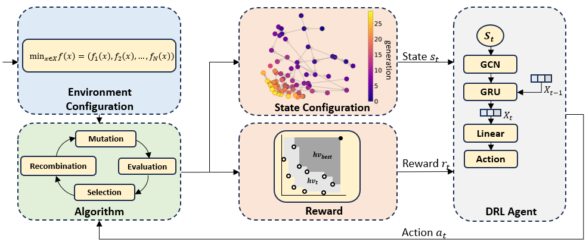

## STN-MODAC: Search Trajectory Network-Enhanced Multi-Objective Dynamic Algorithm Configuration

STN-MODAC introduces a novel methodology that combines Search Trajectory Networks, Temporal Graph Convolutional Networks (T-GCNs) and Deep Reinforcement Learning (DRL) to dynamically configure Evolutionary Algorithms (EAs) for solving Multi-Objective Combinatorial Optimization (MOCO) problems.

## STN-MODAC Framework

The DRL agent configures the next iteration of the search algorithm based on a Search Trajectory Network (STN), where nodes represent non-dominated solutions from the Pareto front of different generations, and edges capture parent-child relationships between solutions. Node features include objective values and a flag indicating if a solution is present in the current population. A Temporal Graph Convolutional Network (T-GCN), combining GCNs with a GRU, processes the STN by integrating embeddings from prior states to capture structural and temporal dynamics
Nodes represent normalized objective values, and edges link solutions based on Pareto fronts. A GNN processes this graph to generate an embedding representing the search state. The DRL agent then outputs new EA parameter configurations, which guide the next iteration. This loop continues until the optimization terminates.



---

## Citation:

If you use STN-MODAC in your research or work, please cite the following paper:

```
@article{reijnengraph,
  title={Search Trajectory Network-Enhanced Multi-Objective Dynamic Algorithm Configuration},
  author={Reijnen, Robbert and Bukhsh, Zaharah and Lau, Hoong Chuin and Wu, Yaoxin and Zhang, Yingqian}
}
```